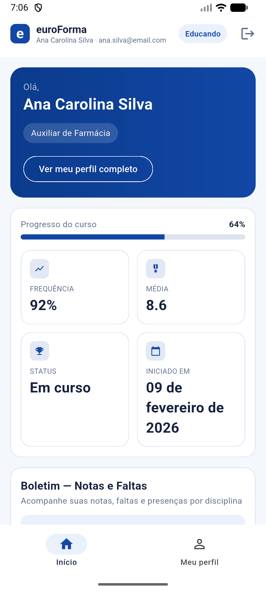
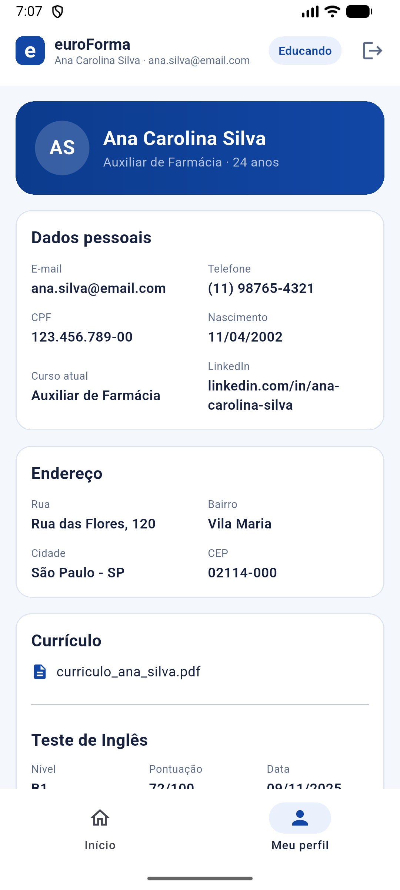
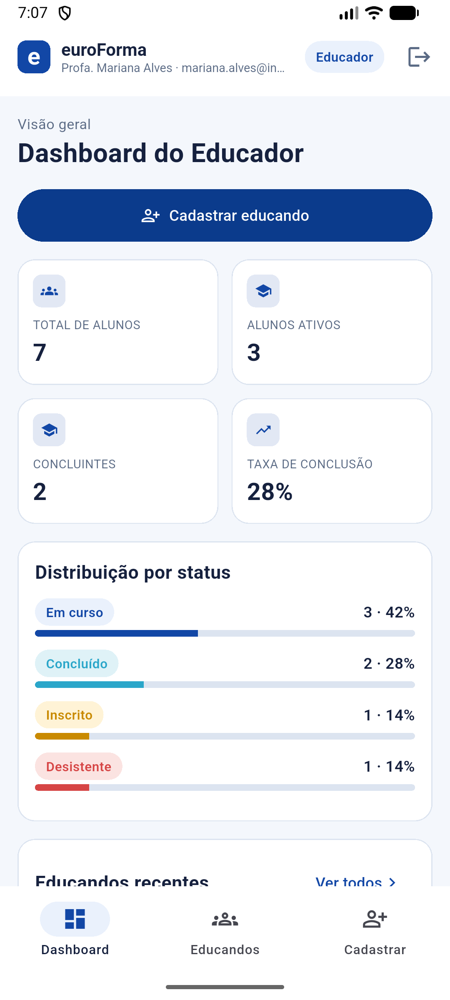
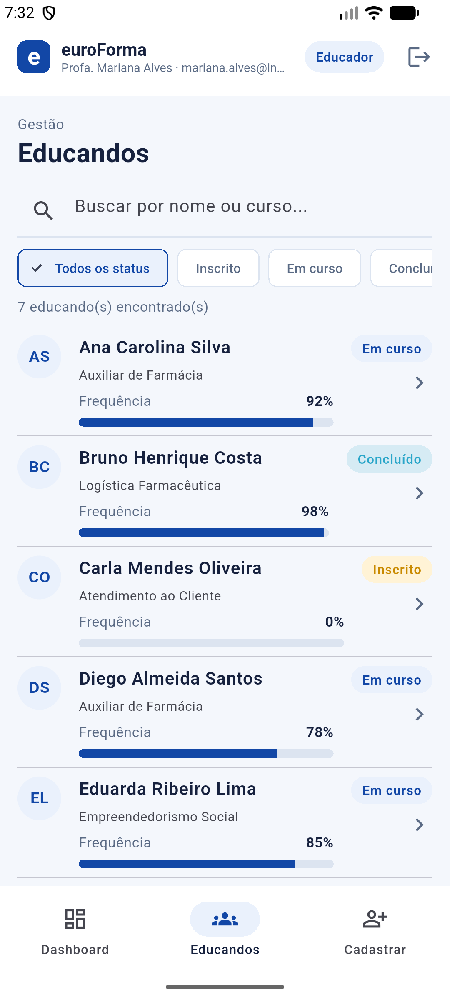
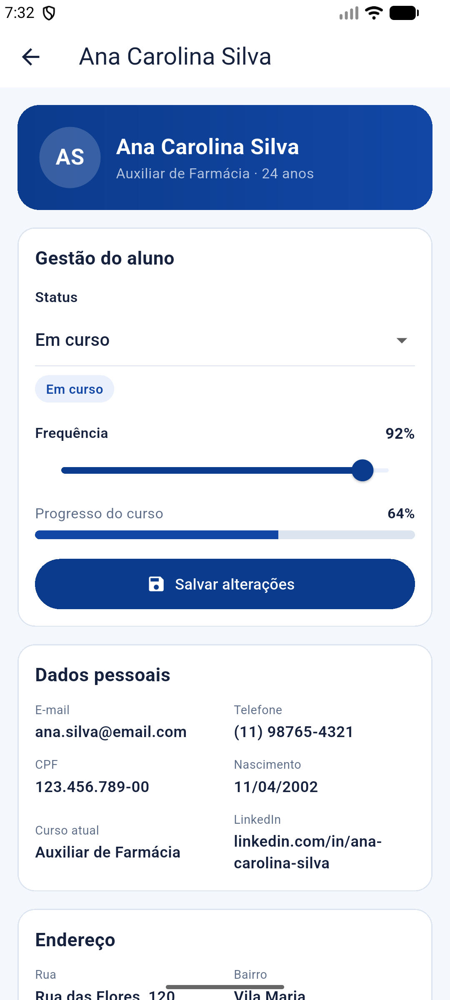
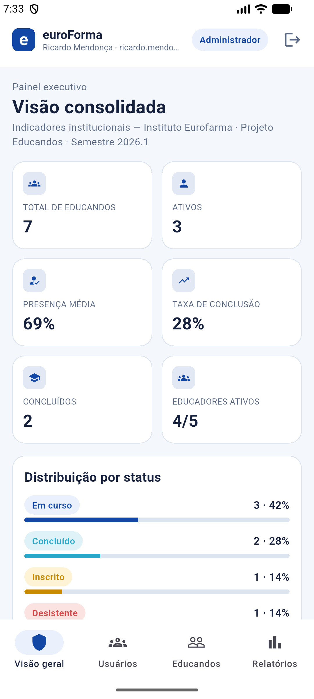
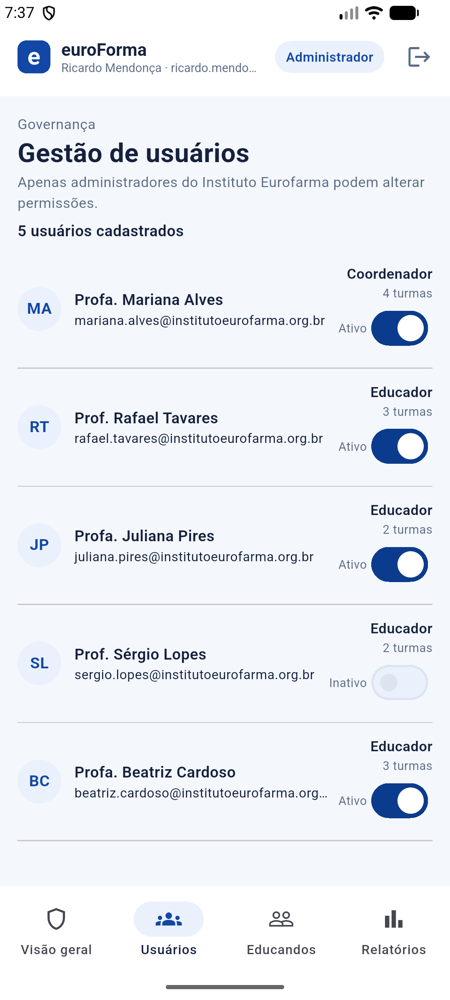
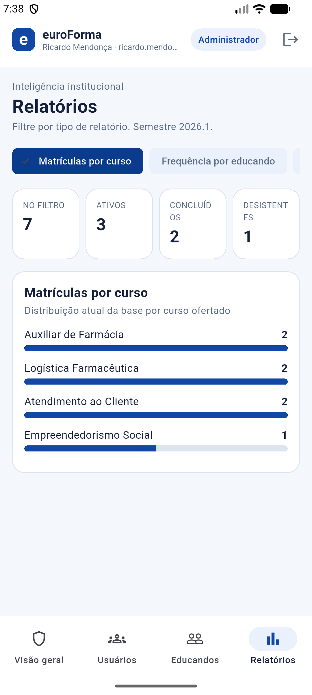

# euroForma (Flutter)

Aplicativo Android desenvolvido em **Flutter** para o **Projeto Educandos do Instituto Eurofarma**, que promove capacitação e desenvolvimento profissional para pessoas em situação de vulnerabilidade social. O app permite acompanhar turmas, notas, frequência e oportunidades (eventos/workshops) em um só lugar, com três perfis de acesso: **Educando**, **Educador** e **Administrador**.

> MVP navegável com dados mockados, sem integração com API, Firebase ou banco de dados. Esta é a versão Flutter do projeto — existe também uma versão em Kotlin/Jetpack Compose com o mesmo escopo, feita em uma Sprint anterior.

## Equipe — FormaLab

| Nome completo      | RM     |
|---------------------|--------|
| Davi Queiroz        | 557483 |
| Graziely Tavares     | 559111 |
| Lucas Oliveira       | 557945 |
| Mariana Torres       | 558956 |
| Maya Tavares         | 559031 |

**Repositório GitHub:** https://github.com/GraziTDS/FlutterEuroForma

**Vídeo de navegação:** [`video/euroforma_demo.mp4`](video/euroforma_demo.mp4) — gravação de tela mostrando o app rodando no emulador Android, passando pelos três perfis e pelas principais telas.

## Funcionalidades implementadas

- **Login com seleção de perfil** — Educando, Educador ou Administrador (autenticação mockada, sem backend).
- **Perfil Educando**: painel inicial com progresso do curso, frequência, média e boletim por disciplina; agenda de próximos eventos com inscrição; ficha de perfil completa (dados pessoais, endereço, currículo, teste de inglês, histórico de cursos e linha do tempo).
- **Perfil Educador**: dashboard com indicadores da turma (total de alunos, ativos, concluintes, taxa de conclusão e distribuição por status); listagem de educandos com busca e filtro por status; cadastro de novo educando via formulário validado; tela de gestão do aluno (alterar status e frequência).
- **Perfil Administrador**: painel executivo institucional (indicadores consolidados de todos os educandos e educadores); gestão de usuários (ativar/desativar contas de educadores/coordenadores); gestão de educandos (mesma listagem/gestão do Educador, em escopo institucional); relatórios filtráveis (matrículas por curso, frequência por educando, conclusão & evasão, motivos de desistência).
- **Navegação real entre telas**, com passagem de parâmetros (ex.: tocar num educando da lista abre a ficha de detalhe daquele educando específico) e retorno visual após ações (SnackBar/banner de sucesso ao cadastrar/salvar).

## Dados mockados

Todos os dados estão organizados em `lib/data/mock_data.dart` (fonte única de dados) e nos modelos em `lib/models/`, evitando dados espalhados nas telas:

- `Educando`, `Educador`, `Administrador`, `Perfil`, `StatusEducando`, `Evento`, `Endereco`, `TesteIngles`, `CursoAnterior`, `HistoricoEvento`, `Disciplina`, `AulaProxima`, `TipoRelatorio` — classes de modelo com dados realistas (nomes, CPFs, cursos, boletins, endereços de São Paulo etc.), sem textos genéricos.
- `AppState` (em `lib/data/app_state.dart`), um `ChangeNotifier` exposto via `AppScope` (`InheritedNotifier`), mantém o estado da sessão (perfil logado, lista de educandos, eventos) mutável em memória — simula cadastro, alteração de status/frequência e inscrição em eventos sem persistência real, como pedido nesta Sprint.

## Tecnologias utilizadas

- **Flutter** 3.44 / **Dart** 3.12 (channel stable)
- **Material 3** (`useMaterial3: true`)
- Navegação via `Navigator` (rotas com `MaterialPageRoute` e passagem de argumentos)
- Gerência de estado com `ChangeNotifier` + `InheritedNotifier` (sem pacotes externos de state management)
- Nenhuma dependência de terceiros além do SDK do Flutter (`cupertino_icons` apenas)

## Arquitetura e organização do código

```
lib/
├── data/            # MockData (fonte de dados mockados) e AppState (estado da sessão)
├── models/          # Classes de dados (Educando, Educador, Perfil, Evento...)
├── theme/           # Cores e ThemeData Material 3
├── widgets/         # Componentes reutilizáveis (SectionCard, StatusChip, StatGrid...)
└── screens/
    ├── login/       # Tela de login com seletor de perfil
    ├── educando/    # Início e Perfil do educando
    ├── educador/    # Dashboard, lista de educandos e cadastro
    ├── admin/       # Visão geral, usuários e relatórios
    └── shared/      # Shells de navegação por perfil + ficha de detalhe do educando
```

## Telas do aplicativo

Capturas de tela do app rodando no **Android Emulator** (AVD `Medium_Phone_API_36.1`, Android 16 / API 36).

### Login
Seleção de perfil (Educando/Educador/Administrador) e acesso à plataforma.


### Início do Educando
Progresso do curso, frequência, média, boletim por disciplina e próximos eventos disponíveis para inscrição.



### Perfil do Educando
Ficha completa: dados pessoais, endereço, currículo, teste de inglês e histórico de cursos anteriores.



### Dashboard do Educador
Indicadores da turma e distribuição de educandos por status.



### Lista de Educandos (Educador)
Busca, filtro por status e frequência de cada educando, com navegação para a ficha de detalhe.



### Gestão do Educando
Alteração de status e frequência do aluno, com ficha completa somente-leitura logo abaixo.



### Cadastrar Educando
Formulário de cadastro com validação de campos obrigatórios.


### Visão Geral (Administrador)
Painel executivo com indicadores institucionais consolidados.



### Gestão de Usuários (Administrador)
Lista de educadores/coordenadores com ativação/desativação de conta.



### Relatórios (Administrador)
Relatórios filtráveis por tipo (matrículas por curso, frequência por educando, conclusão & evasão, motivos de desistência).



## Como executar o projeto

1. Instale o [Flutter SDK](https://docs.flutter.dev/get-started/install) (canal stable, versão 3.44+) e rode `flutter doctor` para confirmar o setup do Android toolchain.
2. Na raiz do projeto, baixe as dependências:
   ```bash
   flutter pub get
   ```
3. Conecte um dispositivo Android ou inicie um emulador (API 26+).
4. Rode o app:
   ```bash
   flutter run
   ```

Alternativamente, para gerar um APK de debug instalável diretamente:

```bash
flutter build apk --debug
```

O APK gerado fica em `build/app/outputs/flutter-apk/app-debug.apk`.

**Requisitos:** Flutter 3.44+, Dart 3.12+, `minSdkVersion` 21 (padrão do template Flutter), Android SDK com `compileSdk`/`targetSdk` mais recentes.
